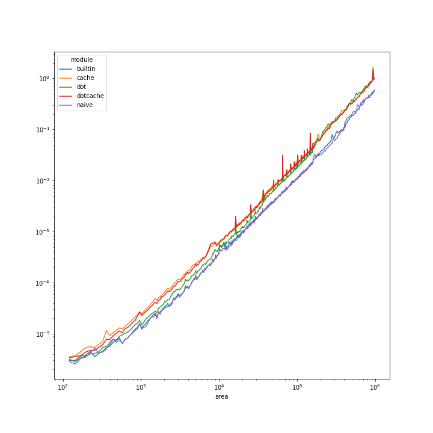

# Building
The program can be compiled using `make main`, producing file `./out/main.o`.  
To choose which multiplication method will be used provide variable to the make file: `make -B main MODULE=dot`. 
## Available modules:
* `naive` - basic matrix multiplication implementation
* `dot` - using the `dot_product` function
* `cache` - optimized for CPU cache
* `dotcache` - both of the above optimizations
* `builtin` - using the `matmul` function

# Testing

Tests can be run with the `make test` command. The tested module can be changed by providing `MODULE` variable, i.e.
```bash
make test -B MODULE=naive # test basic implementation
make test -B MODULE=dot # test dot_product based implementation
```

To run tests for all modules use
```bash
make testall
```

# Time measurements
To generate measurements for all strategies run `make measure`. Results will be written to partial files (per module, ie. `times.naive.csv`) and concatenated to common `times.csv`.

## Results

Using jupyter python notebook a graph of time [seconds] vs matrix size (area) can be generated:  


Interestingly, most methods perform poorer than the no-implementation method,
which is on par with the builtin `matmul` function.


